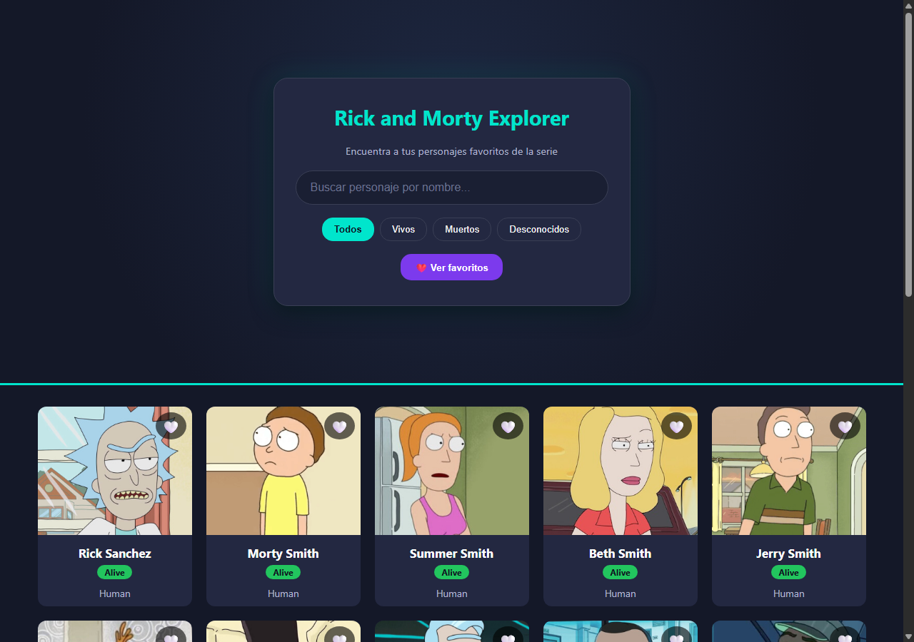
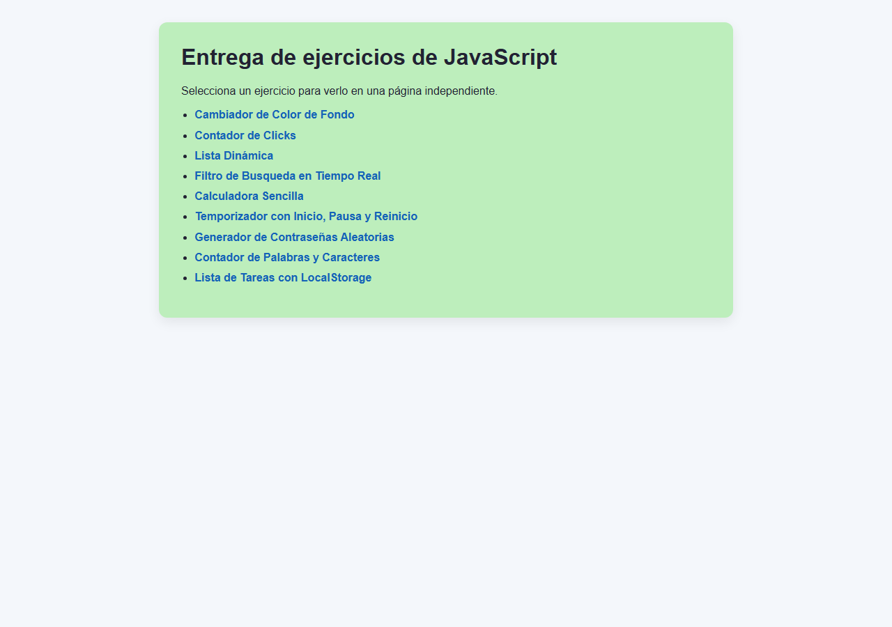
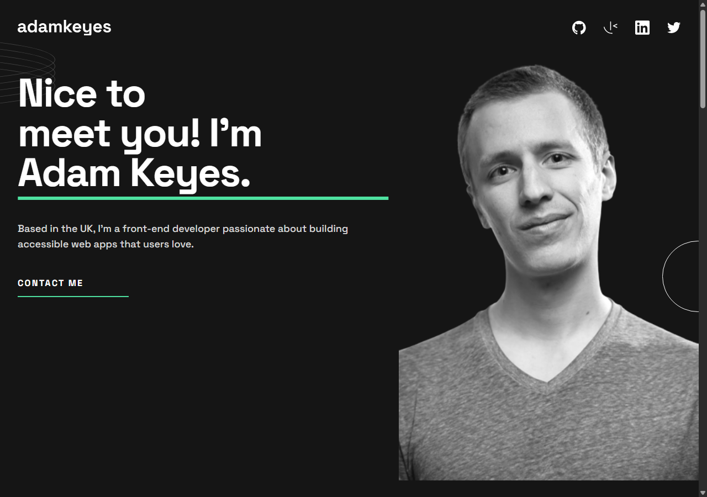
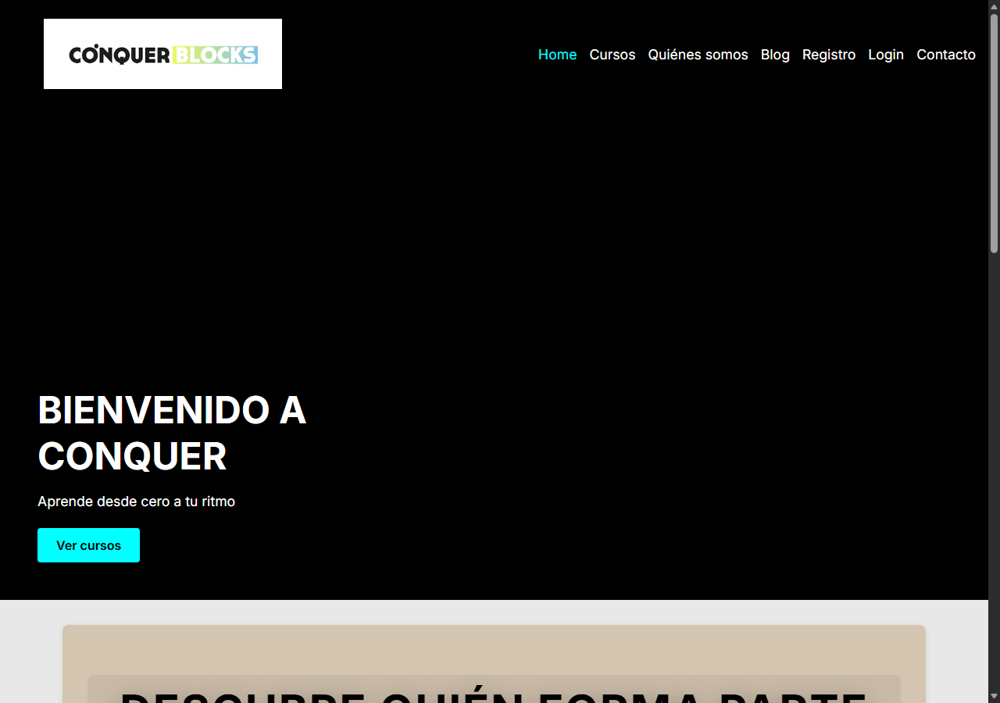

---

## 🧰 Tecnologías

### Frontend

### Backend

**Backend:** Python · Django · SQL

### Herramientas

---

## 📖 Sobre mí

Soy Fidel, desarrollador web **full stack** en formación en **CÓNQUER BLOCKS** 🧠, combinando mi experiencia en automatización industrial  con la programación de aplicaciones web modernas y buscando la mejor funcionalidad en los procesos productivos.

Me apasiona construir interfaces limpias, responsivas y funcionales, y documentar cada proyecto para que sea fácil de entender y reutilizar.

### 💪 Otras habilidades
- **Automatización Industrial** 🤖
- **PLCs** 💻
- **Electricidad** 🔌 🧰 🪛
- **Frío Industrial** ❄️ ⚙️

---

## 🚀 Proyectos destacados

### 🧪 Rick and Morty Explorer
Aplicación que consume **The Rick and Morty API**: búsqueda en tiempo real, filtros por estado, detalle con episodios, favoritos con `localStorage` y diseño responsivo.

🔗 [Repositorio](https://github.com/fidelincidane/Rick-and-Morty-Explorer) · 🌍 [Demo en vivo](https://fidelincidane.github.io/Rick-and-Morty-Explorer/)

### 🧮 Ejercicios JavaScript
Colección de **9 ejercicios** de manipulación del DOM, eventos y `localStorage`: cambiador de color, calculadora, temporizador, lista de tareas y más.

🔗 [Repositorio](https://github.com/fidelincidane/ejercicios-js) · 🌍 [Demo en vivo](https://fidelincidane.github.io/ejercicios-js/)

### 👤 Portfolio
Portfolio personal **responsivo** (móvil, tableta y desktop) construido con **HTML + CSS + Sass + Vite**.

🔗 [Repositorio](https://github.com/fidelincidane/portfolio) · 🌍 [Demo en vivo](https://fidelincidane.github.io/portfolio/)

### 🎓 Academia
Web responsiva para una academia: hero, cursos, blog, contacto y registro, construida con **HTML + CSS + Sass + Vite**.

🔗 [Repositorio](https://github.com/fidelincidane/academia) · 🌍 [Demo en vivo](https://fidelincidane.github.io/academia/)

---

## 📈 Estadísticas

---

## 📬 Contacto

